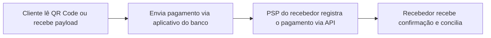
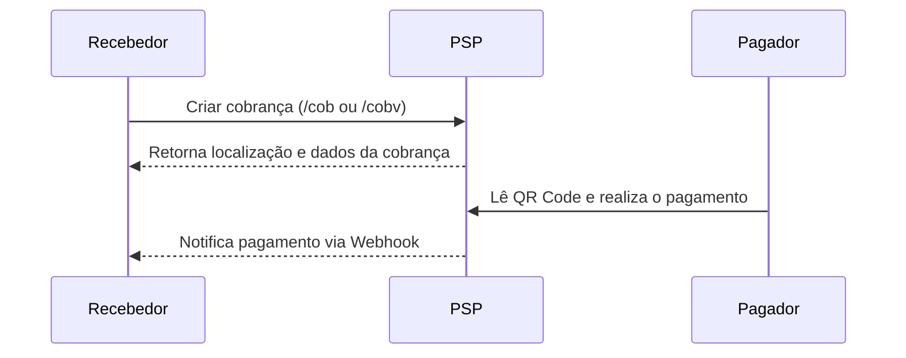

# Visão Geral da API Pix

Este documento resume de forma introdutória como a API Pix funciona, pensando em um público de negócios com pouco conhecimento técnico. Para detalhes completos, consulte a [especificação oficial](../openapi.yaml).

## O que é o Pix

O Pix é o meio de pagamentos instantâneos brasileiro. A API Pix permite que as instituições participantes integrem seus sistemas para registrar cobranças, acompanhar pagamentos e configurar notificações.

## Principais Conceitos

- **Chave Pix:** identificador da conta do recebedor (e-mail, CPF/CNPJ, telefone ou chave aleatória) usado para endereçar pagamentos.
- **Cobrança (Cob):** solicitação de pagamento imediata. Geralmente usada para transações à vista.
- **Cobrança com vencimento (CobV):** permite definir uma data de vencimento e regras de juros, multa e descontos.
- **Cobrança recorrente (CobR):** indica que a cobrança faz parte de uma série periódica.
- **Recorrência (Rec):** configuração de pagamentos que se repetem de forma programada.

A seguir apresentamos uma visão simplificada dos fluxos mais comuns.



## Diferença entre os tipos de cobrança

| Tipo | Endpoint principal | Uso típico |
|------|-------------------|-----------|
| Cob (Imediata) | `/cob` e `/cob/{txid}` | Pagamentos à vista, QR Code dinâmico ou estático com valor definido. |
| Cob com Vencimento (CobV) | `/cobv` e `/cobv/{txid}` | Pagamentos com data de vencimento, podendo ter juros, multa e descontos. |
| Cobrança Recorrente (CobR) | `/cobr` e `/cobr/{txid}` | Pagamentos que se repetem conforme uma programação definida em uma **Recorrência** (`/rec`). |

As cobranças recorrentes (CobR) estão associadas a uma Recorrência (`/rec/{idRec}`) que define periodicidade, valores e condições. Já a Cob com Vencimento (CobV) possui apenas uma data limite para pagamento e pode incluir regras de atualização de valores.

## Visão geral dos endpoints

```mermaid
flowchart TD
    subgraph Cadastro
        cob[POST /cob] -- registrar cobrança imediata --> cobID[PUT /cob/{txid}]
        cobV[POST /cobv] -- registrar cobrança com vencimento --> cobVID[PUT /cobv/{txid}]
        rec[POST /rec] -- criar recorrência --> cobR[POST /cobr]
    end
    subgraph Consulta
        getCob[GET /cob/{txid}] --> getPix[GET /pix/{e2eid}]
        getCobV[GET /cobv/{txid}] --> getPix
        getCobR[GET /cobr/{txid}] --> getPix
    end
    subgraph Notificacoes
        webhook[PUT /webhook/{chave}] -- recebe eventos --> appCliente
    end
```

### Tratamento de regras de negócio

Cada endpoint possui validações específicas descritas na documentação oficial. De forma simplificada:

- **Criação (`POST` ou `PUT`)**: o PSP recebedor valida campos obrigatórios, verifica o formato do `txid` e, no caso de CobV ou CobR, aplica as regras de vencimento e ajustes de valor.
- **Revisão (`PATCH`)**: permite atualizar algumas informações da cobrança, incrementando o campo `revisao`. O PSP verifica se a alteração é permitida para o status atual.
- **Consulta (`GET`)**: retorna o estado atual do recurso. Dependendo do endpoint, é possível filtrar por período, status ou outros atributos.
- **Webhooks**: após configurados, enviam notificações de pagamentos ou devoluções para uma URL informada pelo recebedor.

Para integrações básicas, é comum seguir o fluxo:

1. **Gerar a cobrança** via POST/PUT.
2. **Apresentar o QR Code** ao pagador.
3. **Aguardar a confirmação** do pagamento através de consulta ou Webhook.



Este guia aborda apenas os principais pontos. Para detalhes de todos os parâmetros e exemplos, consulte o arquivo `openapi.yaml`.
